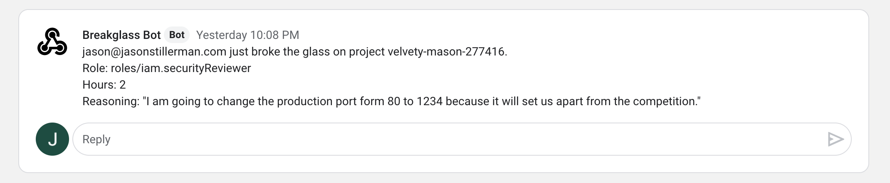

# BreakGlass

### The [Highly Configurable](./CONFIGURE.md) Temporary GCP Privilege Escalation Tool

## What is BreakGlass?

BreakGlass is a tool that allows developers to temporarily escalate their own GCP permissions at any time. This is like the sudo command for GCP permissions. Developers will be able to fix things at 3 AM without waking up the teams RP.




## How it works

1. Sign into the app with your GCP credentials
2. Select a project
3. Select the permissions you need
4. Select a timeframe
5. Provide your reasoning for breaking the glass
6. Your permissions will be provided and the event will be logged

# Getting Started

1. `$ git clone https://github.com/Stillerman/BreakGlass`
2. Create a new GCP project that will house the BreakGlass server.
   `gcloud projects create breakglass-{UniqueID} --name="BreakGlass"`

   Make sure unique ID is a company-specific identifier because the projectID must be unique across all projects on google cloud.

   Set that project to default with
   `gcloud config set project breakglass-{UniqueId}`

3. Create a service account

   ```shell
   gcloud iam service-accounts create sa-breakglass \
   --description="BreakGlass service account" \
   --display-name="sa-breakglass-disp"
   --project=breakglass-{UniqueID from above}
   ```

   You will now be able to see the account with

   ```
   gcloud iam service-accounts list
   ```

   It will be something like `sa-breakglass@breakglass-{uniqueID}.iam.gserviceaccount.com`
   Download the `key.json` file with the following command (be sure you are in the root of the directory you cloned)

   ```
   gcloud iam service-accounts keys create ./key.json \
       --iam-account {The service account you created above}
   ```

   Sign in by running the following

   ```
   gcloud auth activate-service-account {service account} --key-file=key.json
   ```

4. Grant Permissions

   Enable the Cloud Resource Manager API [Here](https://console.cloud.google.com/apis/library/cloudresourcemanager.googleapis.com)
   **Note** be sure that this is for the project Breakglass!

   Next, grant sa-breakglass folder admin in all of the folders that you would like users to have the change to escalate in. Breakglass will only be able to see and update projects where it is the folder admin.

   After permissions are configured, run

   ```
   gcloud projects list
   ```

   and make sure you can see the projects you want breakglass to have access to. **Note** It might take 3-5 minutes for the permissions to update and the projects to be visible.

5. Add OAuth to breakglass project

   Go to the cloud console, select the breakglass project and then navigate to APIs & Services -> Credentials. Click "Create Credentials" -> Oauth Client ID -> Configure Consent Screen -> Internal then provide a display name (probably breakglass) -> Save

   Now go back to credentials -> Create Credentials -> OAuth Client Id -> Application type: Web Application

   Here, you name the key (name doesn't matter) and you also add "Authorized JavaScript Origins". Add just "http://localhost:8080" for now, we will come back to this later.

   Click create and copy the client ID for later. You won't be needed the secret.

6. Configure Breakglass

   Copy `K8s/breakglass-configmap.yaml.example` to `K8s/breakglass-configmap.yaml` and configure it to your needs. Read about possible configurations [here](./CONFIGURE.md).

   **Note** you will need the OAuth Client Id from the previous step.

7. Build the project

   Build the docker image in the minikube context with

   ```
   yarn k8s
   ```

   Configure Kubernetes Project with

   ```
   minkube start
   kubectl apply -f K8s
   ```

   Now the project will be running, but you have not whitelisted the port on the OAuth, so it will not work as is. Ensure everything is working properly by forwarding the port to the pod

   ```
   kubectl port-forward {Naem od pod that was created} 8080:8080
   ```

   Now navigate to `http://localhost:8080`

8. Done.
