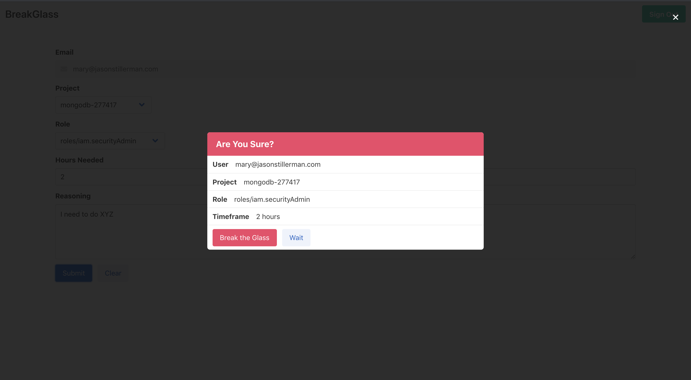

# BreakGlass

Temporary GCP Privilege Escalation Tool

## What is this?

BreakGlass is a tool that allows developers to temporarily escalate their own GCP permissions at any time. This is like the sudo command for GCP permissions. Developers will be able to fix things at 3 AM without waking up the teams RP.

## How it works

1. Sign into the app with your GCP credentials
2. Select a client
3. Select a project
4. Select the permissions you need
5. Select a timeframe
6. Provide your reasoning for breaking the glass
7. Your permissions will be provided and the event will be logged

# Getting Started

1. `$ git clone https://github.com/Stillerman/BreakGlass`
2. Create a new GCP project that will house the BreakGlass server.
   `gcloud projects create breakglass-{UniqueID} --name="BreakGlass"`

   Make sure unique ID is a company-specific identifier because the projectID must be unique across all projects on google cloud.

   Set that project to default with
   `gcloud config set project breakglass-{UniqueId}`

3. Create a service account

   ```shell
   gcloud iam service-accounts create sa-breakglass \
   --description="BreakGlass service account" \
   --display-name="sa-breakglass-disp"
   --project=breakglass-{UniqueID from above}
   ```

   You will now be able to see the account with

   ```
   gcloud iam service-accounts list
   ```

   It will be something like `sa-breakglass@breakglass-{uniqueID}.iam.gserviceaccount.com`
   Download the `key.json` file with the following command (be sure you are in the root of the directory you cloned)

   ```
   gcloud iam service-accounts keys create ./key.json \
       --iam-account {The service account you created above}
   ```

   Enable the Cloud Resource Manager API [Here](https://console.cloud.google.com/apis/library/cloudresourcemanager.googleapis.com)
   **Note** be sure that this is for the project Breakglass!

   Sign in by running the following

   ```
   gcloud auth activate-service-account {service account} --key-file=key.json
   ```

   Run

   ```
   gcloud projects list
   ```

   and make sure you can see the projects

4. Grant Permissions

   Grant sa-breakglass folder admin in all of the folders that you would like users to have the change to escalate in. Breakglass will only be able to see and update projects where it is the folder admin.

5. Add OAuth to breakglass project

   Go [here](https://developers.google.com/identity/sign-in/web/sign-in#before_you_begin) and click "Configure a project"

   Select BreakGlass and when it asks "Where are you calling from?" Select "Web Browser". Follow prompts until you get the OAuth Client Id. That will be needed for later.

6. Configure Breakglass

   Rename `conf.yaml.example` to `conf.yaml` and configure it to your needs. Read about possible configurations [here](./CONFIGURE.md).

   In the root of the project create `.secrets` file.The file should be in the root folder (the one with `Dockerfile` in it) and should be in the following format

   ```
   ServiceAccount=breakglass-sa@XXX
   KeyFile=key.json
   ```

7. Build the project

   To run the project with docker, run

   ```
   yarn docker
   docker run jstillerman/breakglass:v1 -p 8080:8080
   ```

   to run with Kubernetes run

   ```
   yarn k8s
   ```

   Note you will need to whlelist the ip that the project is running on before OAuth will work.

   Add the ip address and port (ie `http://localhost:8080`) to the OAuth credentials allowed domains whitelist

8. Done.

   
