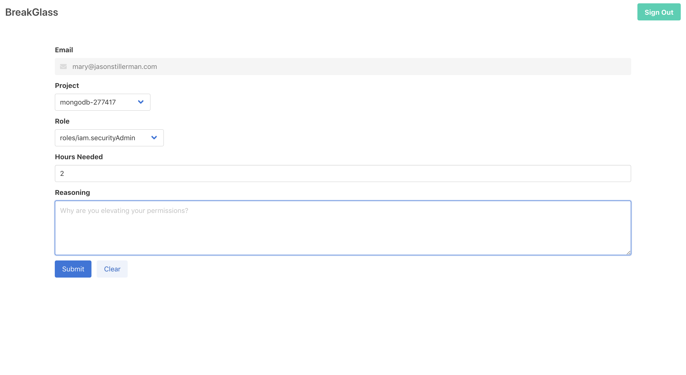

# BreakGlass

Temporary GCP Privilege Escalation Tool

## What is this?

BreakGlass is a tool that allows developers to temporarily escalate their own GCP permissions at any time. This is like the sudo command for GCP permissions. Developers will be able to fix things at 3 AM without waking up the teams RP.

## How it works

1. Sign into the app with your GCP credentials
2. Select a client
3. Select a project
4. Select the permissions you need
5. Select a timeframe
6. Provide your reasoning for breaking the glass
7. Your permissions will be provided and the event will be logged

## UI

`yarn docker`

`docker run -p 8080:8080 -d breakglass`

Then navigate to `http://localhost:8080` and you will see this UI.

## CLI

Bobs new credentials (only will work if you are already signed into gcloud with admin privileges)

**NOTE** This does not work if you select `roles/editor` because it is a primitive role. It will work if you select `roles/iam.securityReviewer`
